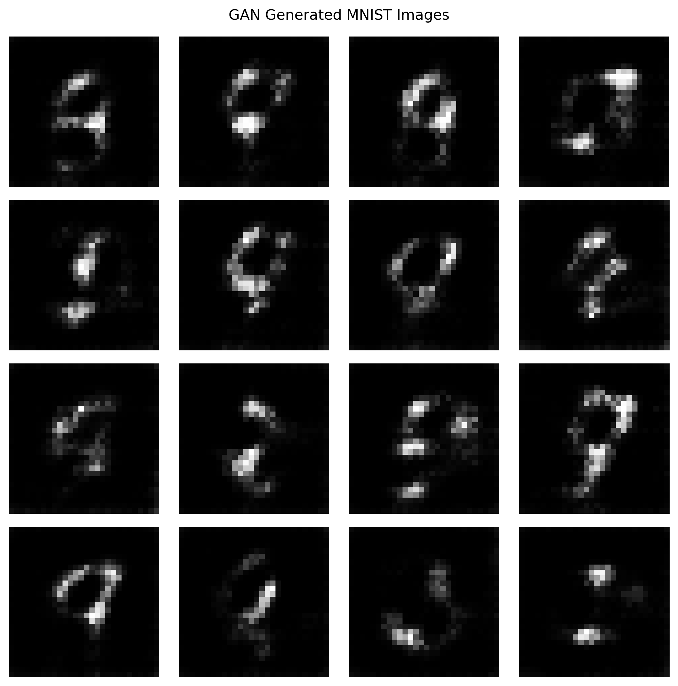

# Generative Models with GANs – MNIST Image Generation

## 📌 Project Overview

This project implements a **Generative Adversarial Network (GAN)** using **TensorFlow and Keras** to generate new handwritten digit images.

The model is trained on the **MNIST handwritten digit dataset**, which contains grayscale images of digits from 0 to 9. The GAN learns the visual patterns of handwritten digits and generates new synthetic images that resemble the original MNIST samples.

The project demonstrates the fundamentals of **Generative AI, Deep Learning, Neural Networks, and Image Generation**.

---

## 🎯 Objectives

* Understand the concept of Generative Adversarial Networks.
* Implement a GAN using TensorFlow and Keras.
* Train a Generator and Discriminator simultaneously.
* Use the MNIST dataset for image generation.
* Generate new handwritten digit images.
* Save and reuse the trained Generator model.
* Visually evaluate the generated images.

---

## 🧠 What is a GAN?

A **Generative Adversarial Network (GAN)** is a deep learning architecture consisting of two neural networks:

### 1. Generator

The Generator creates synthetic images from random noise.

Its objective is to generate images that look realistic enough to fool the Discriminator.

```text
Random Noise
     ↓
 Generator
     ↓
Generated Image
```

### 2. Discriminator

The Discriminator receives both real and generated images and determines whether an image is real or fake.

```text
Real Image ─────┐
                ↓
          Discriminator
                ↓
          Real / Fake
                ↑
Generated Image ┘
```

The Generator and Discriminator compete against each other during training.

---

## 🔄 GAN Training Process

The GAN training process works as follows:

```text
                Random Noise
                     │
                     ▼
               ┌───────────┐
               │ Generator │
               └─────┬─────┘
                     │
                     ▼
              Fake MNIST Image
                     │
                     ▼
              ┌──────────────┐
Real MNIST ──►│Discriminator │
              └──────┬───────┘
                     │
                     ▼
               Real / Fake
                     │
                     ▼
              Loss Calculation
                     │
                     ▼
             Model Optimization
```

During training:

1. Random noise is provided to the Generator.
2. The Generator creates a fake image.
3. Real MNIST images are obtained from the dataset.
4. The Discriminator evaluates both real and fake images.
5. Generator and Discriminator losses are calculated.
6. Both networks are updated using backpropagation.
7. The Generator gradually improves its ability to create realistic digit images.

---

## 📊 Dataset

### MNIST Dataset

The **MNIST dataset** contains handwritten digits from **0 to 9**.

| Property          | Value     |
| ----------------- | --------- |
| Training Images   | 60,000    |
| Testing Images    | 10,000    |
| Image Size        | 28 × 28   |
| Image Type        | Grayscale |
| Number of Classes | 10        |
| Pixel Range       | 0–255     |

For GAN training, the images are normalized to the range:

```text
-1 to +1
```

The images are also reshaped to include a single grayscale channel:

```text
28 × 28 × 1
```

---

## 🏗️ Model Architecture

### Generator Architecture

The Generator accepts a random noise vector of dimension **100**.

```text
Input Noise: 100
      ↓
Dense Layer
      ↓
7 × 7 × 256
      ↓
Reshape
      ↓
Conv2DTranspose – 128 filters
      ↓
Conv2DTranspose – 64 filters
      ↓
Conv2DTranspose – 1 filter
      ↓
28 × 28 × 1 Image
```

The final layer uses the **Tanh activation function**, producing pixel values approximately in the range:

```text
-1 to +1
```

### Discriminator Architecture

The Discriminator receives a `28 × 28 × 1` image.

```text
28 × 28 × 1 Image
        ↓
Conv2D – 64 filters
        ↓
LeakyReLU
        ↓
Dropout
        ↓
Conv2D – 128 filters
        ↓
LeakyReLU
        ↓
Dropout
        ↓
Flatten
        ↓
Dense
        ↓
Real / Fake Score
```

---

## ⚙️ Training Configuration

The GAN was trained using the following configuration:

| Parameter       |                Value |
| --------------- | -------------------: |
| Dataset         |                MNIST |
| Image Size      |              28 × 28 |
| Image Channels  |                    1 |
| Noise Dimension |                  100 |
| Batch Size      |                  128 |
| Epochs          |                   10 |
| Optimizer       |                 Adam |
| Learning Rate   |               0.0002 |
| Adam β₁         |                  0.5 |
| Loss Function   | Binary Cross-Entropy |

---

## 🛠️ Technologies Used

* **Python**
* **TensorFlow**
* **Keras**
* **NumPy**
* **Matplotlib**
* **Google Colab**
* **Jupyter Notebook**
* **GitHub**

---

## 📁 Project Structure

```text
Generative-Models-GAN-MNIST/
│
├── GAN_MNIST_Image_Generation.ipynb
│
├── mnist_gan_generator.keras
│
├── gan_generated_mnist.png
│
├── requirements.txt
│
└── README.md
```

### File Description

| File                               | Description                                  |
| ---------------------------------- | -------------------------------------------- |
| `GAN_MNIST_Image_Generation.ipynb` | Complete Google Colab/Jupyter implementation |
| `mnist_gan_generator.keras`        | Trained Generator model                      |
| `gan_generated_mnist.png`          | Sample images generated by the GAN           |
| `requirements.txt`                 | Required Python libraries                    |
| `README.md`                        | Project documentation                        |

---

## 🚀 How to Run the Project

### Option 1 – Google Colab

1. Open Google Colab.
2. Upload:

```text
GAN_MNIST_Image_Generation.ipynb
```

3. Run the notebook cells sequentially.
4. The MNIST dataset will be loaded automatically through TensorFlow/Keras.
5. Train the GAN.
6. Generate new handwritten digit images.
7. Save the trained Generator.

### Option 2 – Local Python Environment

Clone the repository:

```bash
git clone https://github.com/YOUR-USERNAME/Generative-Models-GAN-MNIST.git
```

Navigate into the project:

```bash
cd Generative-Models-GAN-MNIST
```

Install the required packages:

```bash
pip install -r requirements.txt
```

Open the notebook:

```bash
jupyter notebook
```

Then run:

```text
GAN_MNIST_Image_Generation.ipynb
```

---

## 🖼️ Results

The trained GAN successfully generated new handwritten digit-like images from random noise.

The generated samples are saved in:

```text
gan_generated_mnist.png
```

The trained Generator is saved as:

```text
mnist_gan_generator.keras
```

### Generated Image Example

Add the generated image to your GitHub README by placing this Markdown below after uploading the image:

```markdown

```

---

## 💾 Using the Saved Generator

The trained Generator can be loaded without retraining the complete GAN:

```python
from tensorflow.keras.models import load_model

saved_generator = load_model(
    "mnist_gan_generator.keras"
)
```

New random noise can then be generated:

```python
import tensorflow as tf

noise = tf.random.normal([16, 100])

new_images = saved_generator(
    noise,
    training=False
)
```

This produces:

```text
16 × 28 × 28 × 1
```

new synthetic images.

---

## 📈 Evaluation

The generated images were evaluated visually based on:

* Digit-like appearance
* Image clarity
* Variation between generated samples
* Similarity to handwritten MNIST patterns
* Successful generation of new synthetic images

For this educational GAN implementation, **visual inspection** is used as the primary evaluation method.

More advanced GAN projects can use quantitative metrics such as:

* FID – Fréchet Inception Distance
* Inception Score
* Precision and Recall for Generative Models

---

## 🔑 Key Learning Outcomes

Through this project, the following concepts were implemented:

* Generative Adversarial Networks
* Generator neural networks
* Discriminator neural networks
* Adversarial training
* Random noise vectors
* Transposed convolution
* Convolutional neural networks
* Batch normalization
* LeakyReLU activation
* Dropout
* Binary cross-entropy loss
* Adam optimization
* Image normalization
* Synthetic image generation
* Saving and loading trained Keras models

---

## ⚠️ Limitations

This project uses a relatively simple GAN architecture and a limited training configuration.

Possible limitations include:

* Generated images may not always be perfectly recognizable.
* Some generated images may contain distorted digit structures.
* GAN training can be computationally intensive.
* GANs can suffer from **mode collapse**, where the Generator produces similar outputs.
* Only visual evaluation is performed.

---

## 🔮 Future Enhancements

The project can be improved by:

* Increasing the number of training epochs.
* Using a more advanced **DCGAN** architecture.
* Training on CIFAR-10 or larger image datasets.
* Implementing conditional GANs to generate specific digits.
* Adding quantitative evaluation metrics such as FID.
* Implementing Wasserstein GAN (WGAN).
* Adding a graphical user interface for image generation.
* Comparing different GAN architectures.
* Using GPU acceleration for faster training.

---

## 🏁 Conclusion

This project successfully demonstrates the implementation of a **Generative Adversarial Network using TensorFlow and Keras**.

The GAN was trained using the MNIST dataset, with a Generator learning to create handwritten digit-like images from random noise and a Discriminator learning to distinguish between real and generated images.

The trained Generator was successfully saved and used to generate new MNIST-style images without retraining the model.

This project provides a practical introduction to **Generative AI, GANs, Deep Learning, and Synthetic Image Generation**.

---

## 👨‍💻 Author

**Sana Kishore**

Third-Year Student
Machine Learning / Data Analytics Project

---

## 📜 License

This project is intended for **educational and academic purposes**.
